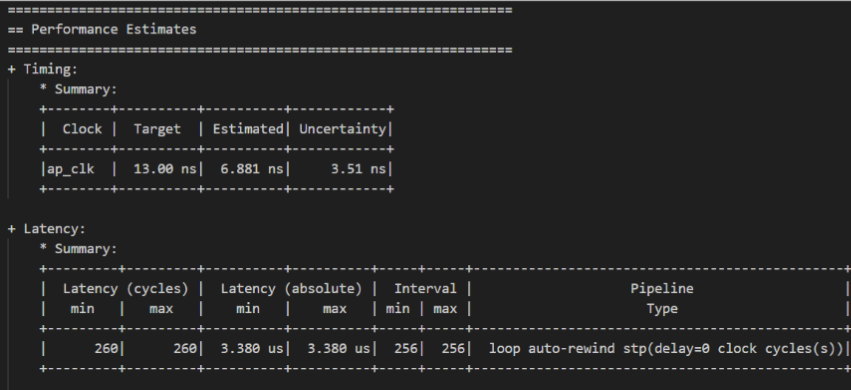
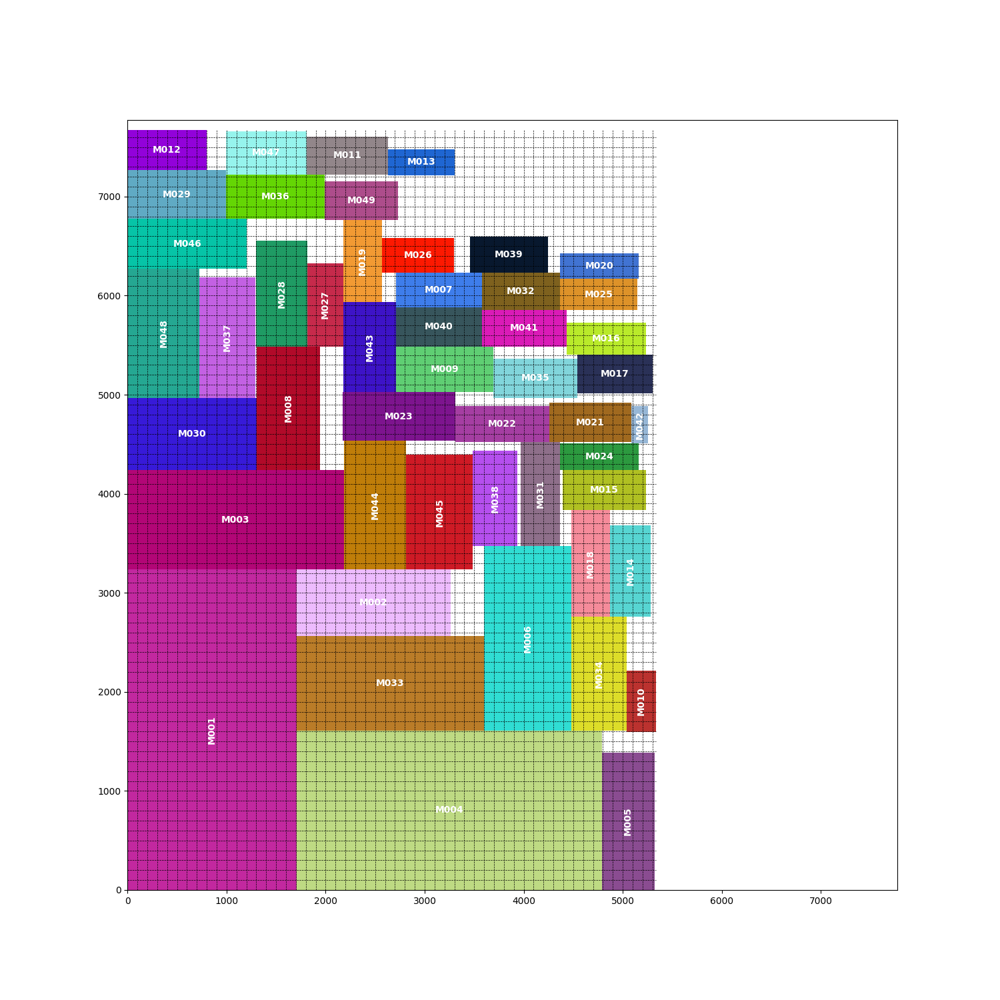

<!--
 * @Descripttion: Edit your description
 * @Author: Albresky
 * @Date: 2024-11-28 13:56:02
 * @LastEditors: Albresky
 * @LastEditTime: 2024-12-13 16:38:17
-->
# BUPT 数字 EDA 理论基础 | Lab 实验

# Intro

本 repo 是 BUPT 数字 EDA 理论基础课程的实验内容，主要包括以下几个部分：

 - Lab1.1: Matrix Multiplication
    - `unroll`, `pipeline`, `array partition`, etc. HLS pragma
    - Block-level parallelism in MM with `dataflow` HLS pragma

 - Lab2.2: Floorplan Algorithm
    - ~~BStarTree-based(decrepated)~~
    - *Simulated Annealing* optimization
    - Tools implemented:
        - parser
        - visualizer
        - floorplanner

# Demo

<table>
  <tr>
    <th>
    
    </th>
    <th>
    
    </th>
  </tr>
  <tr>
    <td>
    
    </td>
    <td>
    
    </td>
</tr>
</table>

# About

第一次写 Floorplan，轻喷，LOL...